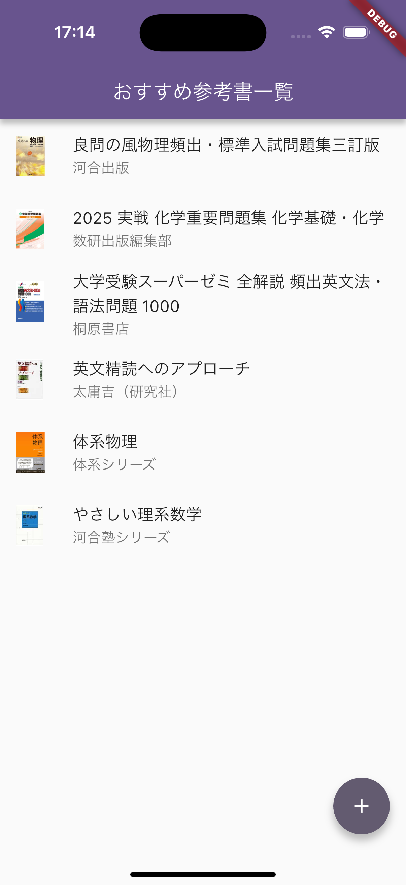
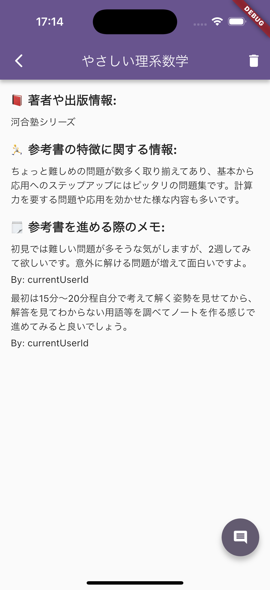
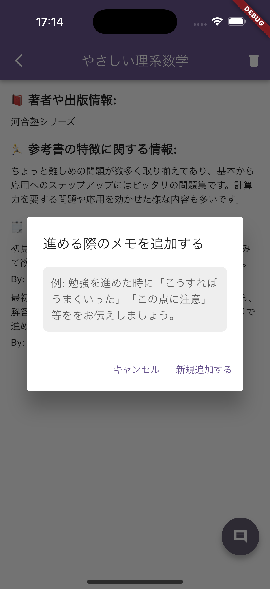
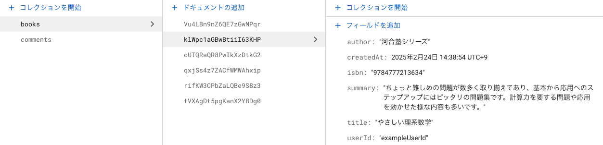

# New Rivepod & Firestore Example

## 📄 概要

Flutter ＆ Riverpod & Firestore & Freezedを利用した簡易的な書籍メモ管理アプリサンプルになります。

__【画面スクリーンショット】__

 

 

__【Firestoreでのデータ保持】__

 


## ⚠️ 注意

実装する上でのハマったポイントをいくつか列挙します。

### 1. 書籍IDに紐づくコメントを取得する際の処理

```dart
Future<List<Comment>> getComments(String bookId) async {
  final snapshot = await _firestore
    .collection('comments')
    // MEMO: このままだとエラーとなるので、インデックスを追加する必要有
    // 👉 エラーメッセージに表示されているリンクを押下して設定する
    .where('bookId', isEqualTo: bookId)
    .orderBy('createdAt', descending: true)
    .get();
  return snapshot.docs.map((doc) => Comment.fromFirestore(doc)).toList();
}
```

### 2. 書籍削除時に紐づくコメントも同時に削除する際の処理

```dart
Future<void> deleteComment(String bookId) async {
  final snapshot = await _firestore
    .collection('comments')
    .where('bookId', isEqualTo: bookId)
    .get();
  for (var doc in snapshot.docs) {
    doc.reference.delete();
  }
}
```
