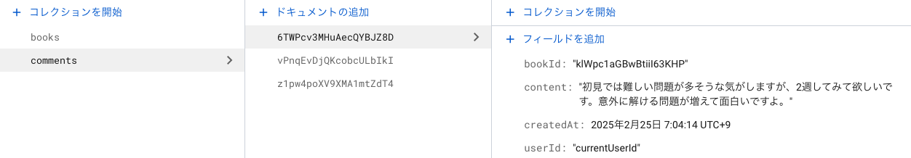

# New Rivepod & Firestore Example

## 📄 概要

Flutter ＆ Riverpod & Firestore & Freezedを利用した簡易的な書籍メモ管理アプリサンプルになります。

### 1. 想定アーキテクチャ概要


### 2. 画面スクリーンショット

サンプル的には参考書を登録して、任意の参考書に紐づくコメントを複数件書き込む事ができるだけのシンプルなものになります。

 

 

### 3. Firestoreでのデータ保持

① 参考書を管理するCollection

 

② 参考書に紐づくコメントを管理するCollection



## ⚠️ 注意

実装する上でのハマったポイントをいくつか列挙します。

### 1. 書籍IDに紐づくコメントを取得する際の処理

```dart
Future<List<Comment>> getComments(String bookId) async {
  final snapshot = await _firestore
    .collection('comments')
    // MEMO: このままだとエラーとなるので、インデックスを追加する必要有
    // 👉 エラーメッセージに表示されているリンクを押下して設定する
    .where('bookId', isEqualTo: bookId)
    .orderBy('createdAt', descending: true)
    .get();
  return snapshot.docs.map((doc) => Comment.fromFirestore(doc)).toList();
}
```

### 2. 書籍削除時に紐づくコメントも同時に削除する際の処理

```dart
Future<void> deleteComment(String bookId) async {
  final snapshot = await _firestore
    .collection('comments')
    .where('bookId', isEqualTo: bookId)
    .get();
  for (var doc in snapshot.docs) {
    doc.reference.delete();
  }
}
```
